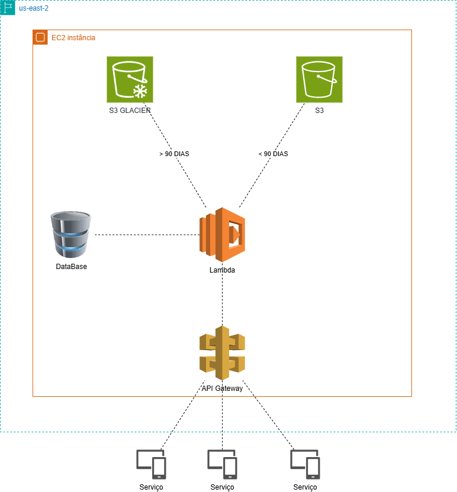

# Diagrama de utilização EC2 na AWS 

O seguinte repositório é referente ao projeto prático da plataforma <b>DIO</b>, em um bootcamp com a <b>GFT Tecnologhy</b>.

Funcionalidades Usadas

<ol>
    <li>ECS</li>
    <li>LAMBDA</li>
    <li>S3</li>
    <li>API Gateway</li>
</ol>

